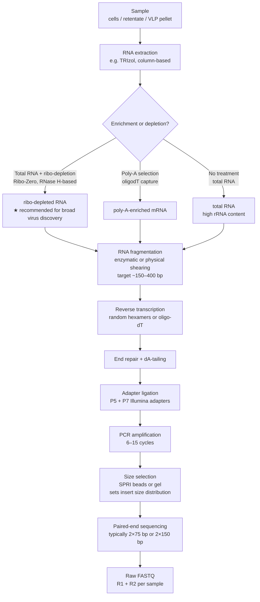

# Background and Design Choices

This document provides the biological and computational context for the choices made in RolyPoly's presets and processing steps.

<!--warning notice  -->
> [!WARNING]  
> This document is still UNDER HEAVY WORK - Some of details may be incomplete, wrong, and for now this is not for human consumption.

## `filter-reads` and `assemble`

### tl;dr preset choice

How your RNA was prepared for sequencing is usually the main thing that determines which preset to use. Three factors tend to matter most: 1. whether your library was **poly-A selected**, 2. whether you want to filter potential **host cDNA/mRNA** and other contaminants, and 3. whether your sample came from enriched/purified virions (**"virome"**), where you can often skip rRNA removal and sometimes use lighter quality filtering.

- If your library is poly-A selected: RolyPoly includes a poly-A trimming step in `filter-reads`.
- If you want host filtering: provide a host reference genome to `filter-reads` and `assemble` (RolyPoly will try to mask likely viral regions in that reference before using it for filtering).
- If your sample is virome-enriched: you can often skip rRNA and host removal, use lighter quality filtering, and sometimes enable deduplication steps (depending on your goals).

*Note: "host" removal can also remove EVEs or integrated viral sequences, so it may not be ideal if you are interested in non-RNA viruses or endogenous viral elements related to your study.*

---

### From sample to reads: the wet-lab pipeline

Before we get "reads", the biological material goes through a series of wet-lab steps that strongly shape what the sequencing data look like. Understanding that chain helps with picking in-silico settings and avoiding unexpected read loss.

The steps and methods below are usually chosen based on study goals and budget. Many introduce bias, but also reduce cost or increase throughput. For example, rRNA depletion kits do not equally target all domains of life, but they can substantially reduce the sequencing depth needed.

In most non-targeted genomics or metagenomics studies, the starting material can be anything from a single host species and its infecting virus, to a complex mixture spanning multiple domains of life (table 1). The "meta" prefix (e.g. metagenomics, metatranscriptomics) generally implies a mixed community as the source.

Regardless of source type, material is usually processed through a mix of chemical, enzymatic, and physical steps depending on study focus. The tables below summarize common steps across the wet-lab pipeline: sample handling before nucleic acid extraction (table 2), extraction itself (table 3), post-extraction processing (table 4), and library preparation (table 5). For RNA virus-centric/transcriptomic work, this usually means RNA extraction, often with rRNA depletion or poly-A selection, followed by reverse transcription to cDNA. Direct RNA sequencing is also possible (e.g. Oxford Nanopore), though still less common in many workflows.

Note: this overview is intentionally practical and not exhaustive.

**Table 1: Common sample sources for RNA virus discovery**

| Source | What it contains | Notes for virus discovery |
|---|---|---|
| Monoculture / host cells / tissue | Predominantly host RNA; viral RNA if infected | High host rRNA background expected. Consider including a host reference for filtering if target virus(es) can be distinguished from host sequences - note that some viruses have endogenized relatives (EVEs) or an integrated stage (e.g. retroviruses). |
| Environmental (water / soil / sediment / biofilm / atmospheric dust...) | Mixed community (bacteria, archaea, eukaryotes, viruses...) | No single host reference; rRNA dominates. |
| Environmental concentrate (e.g. filter retentate 0.2–3 µm, ultracentrifugation) | Similar to raw environmental sources, but pre-processed to enrich or deplete size fractions | Can be used for community-level expression analysis (metatranscriptomics) as well as virus discovery. Depending on pre-processing, free virions may be depleted, meaning virus discovery may reflect intracellular viral RNA rather than extracellular virions. |
| VLPs / protected environmental nucleic acids (e.g. ultracentrifugation / sucrose gradient / FeCl₃ precipitation / 0.1 µm filtrate / TFF) | Enriched sub-cellular fraction; virions, membrane vesicles, mobile genetic elements; some host debris | DNase/RNase treatment prior to extraction can greatly reduce host background, but low yields may necessitate amplification (e.g. RCA, MDA), which can introduce chimeras and skew abundances. |

---

Once the sample is collected, it usually goes through pre-extraction processing. These steps act on physical or chemical properties of the sample (size, density, protection status, membrane/protein integrity) and can strongly affect what ends up in the extracted material. For our use case, one key distinction is whether the sample was further enriched for viruses (e.g. VLP-focused workflows, often called "viromics"). Some steps also serve multiple practical purposes, such as buffer exchange, inhibitor removal, or transport/storage stabilization.

A practical note on filtration: the steps listed in table 2 can be used in combination, and it is entirely possible to use the retentate from one filter as the input to a second filtration step, or to collect the filtrate instead - the choice depends on which size fraction is of interest.

**Table 2: Common pre-nucleic acid extraction processing steps**

| Processing Step | What it does | Notes for virus discovery |
|---|---|---|
| Centrifugation (low speed / clarification) | Removes large debris and intact cells by pelleting | Standard first step in many protocols; supernatant is carried forward |
| Homogenization / bead beating | Disrupts tissue or cell-rich material into a homogenate | Releases intracellular contents including host RNA; increases host background |
| Filtration (large pore, e.g. 5–20 µm) | Removes large debris, most eukaryotic cells, and multicellular material | Helps reduce host cell material; virions and small prokaryotes pass through freely |
| Filtration (small pore, e.g. 0.2–0.45 µm) | Retains bacteria and larger particles; virions pass into filtrate | Can deplete prokaryotic cells; filtrate is enriched for virions and small VLPs |
| Tangential flow filtration (TFF) | Concentrates particles within a size range | Useful for large volume samples (e.g. seawater); retains virions while removing small molecules |
| Ultracentrifugation / sucrose gradient | Separates particles by size and density | Can enrich for VLP/virion fractions; may co-pellet host debris and membrane vesicles |
| Chemical treatment (e.g. FeCl₃ precipitation) | Precipitates virions or nucleic acid-associated particles | Low-cost concentration method for large volumes; efficiency varies by virus type |
| Proteinase K treatment | Degrades proteins in the sample | Can improve nucleic acid yield and purity by removing protein-nucleic acid complexes; may also disrupt non-enveloped virion capsids if not controlled carefully |
| Chloroform / organic solvent treatment | Denatures and removes lipids and proteins | Commonly used in phenol-chloroform extraction; also used pre-extraction to disrupt enveloped viruses and remove host membrane material - note this will also disrupt enveloped virions |
| DNase / RNase treatment (pre-extraction) | Degrades unprotected extracellular nucleic acids in the sample | Reduces free host nucleic acid contamination; nucleic acids inside virions or vesicles are protected and retained |

Many of these steps are combined within a single protocol or commercial kit. Some steps also serve multiple roles - for example, a buffer exchange step may simultaneously remove inhibitors while concentrating the sample.

---

Nucleic acid extraction is the step that liberates nucleic acids from biological material. The method you choose can introduce bias in yield, purity, and which nucleic acid species are recovered. For RNA virus discovery, RNA extraction is usually the default, though total nucleic acid (TNA) extraction is also used when both DNA and RNA are of interest (for example, mixed RNA/DNA virus surveys or integrated proviral sequence detection).

**Table 3: Common nucleic acid extraction methods**

| Method | What it recovers | Notes for virus discovery |
|---|---|---|
| TRIzol / phenol-chloroform extraction | Total RNA (and DNA if desired) | Robust and widely used; recovers a broad size range of RNA; requires careful handling of hazardous reagents; co-extracted DNA can be removed by DNase treatment if needed |
| Silica column-based RNA extraction (e.g. Qiagen RNeasy, Zymo) | Total RNA above a size threshold (typically >200 nt) | Convenient and fast; small RNAs (e.g. siRNAs, miRNAs) may be lost unless a specific small RNA kit is used; yields can be low for dilute or complex samples |
| Total nucleic acid (TNA) extraction | Both DNA and RNA | Useful when both RNA and DNA viruses are of interest; downstream DNase or RNase treatment can separate the pools if needed |
| Small RNA extraction / enrichment | RNA below ~200 nt (miRNA, siRNA, piRNA) | Specifically targets small RNA species; relevant for studies of RNA silencing or small RNA-based virus detection; full-length viral genomes will be depleted |
| Direct lysis (e.g. in low-input or single-cell protocols) | Variable; depends on lysis conditions | Minimises handling loss; may co-extract inhibitors; often paired with whole-transcriptome amplification |

---

After extraction, a second round of processing is often used to reshape the nucleic acid pool by removing unwanted species or adjusting yield/purity before library prep. These steps act on the molecules directly (not the physical sample) and can have a large effect on what gets sequenced.

**Table 4: Common post-nucleic acid extraction processing steps**

| Processing Step | What it does | Notes for virus discovery |
|---|---|---|
| DNase treatment (on-column or in-solution) | Degrades residual DNA from the extracted nucleic acid pool | Important for RNA-focused studies to reduce DNA carryover; critical if reverse transcription is used, to avoid amplifying DNA templates |
| Ribosomal RNA (rRNA) depletion | Removes rRNA using probe-based hybridization and depletion (e.g. RiboZero, NEBNext) | rRNA is often the dominant fraction in total RNA (commonly around 80-90%+); depletion increases the proportion of informative transcripts, but probe sets may not cover non-model organisms well |
| Poly-A selection | Captures polyadenylated RNA using oligo-dT beads | Enriches for eukaryotic mRNA and some RNA viruses that have poly-A tails; depletes rRNA, bacterial RNA, and non-polyadenylated viral RNA |
| Size selection | Retains RNA fragments within a target size range | Can be used to enrich for small RNAs such as siRNAs or miRNAs; may deplete full-length viral genomes |
| RNA concentration / cleanup | Removes salts, enzymes, or other inhibitors (e.g. column cleanup, ethanol precipitation) | Important for downstream enzymatic steps; low-yield samples risk loss during cleanup |
| Amplification (e.g. RCA, MDA) | Increases the total amount of nucleic acid | Necessary for low-yield samples; can introduce chimeric reads, amplification bias, and skewed abundances - complicates quantification |

---

Library preparation converts processed nucleic acid into sequencing-ready molecules. For RNA libraries, this begins with reverse transcription to cDNA; after that, the workflow broadly resembles DNA library prep. Choices at this stage, especially fragmentation, priming strategy, and strand specificity, can strongly affect how viral sequences are represented and interpreted downstream.

When working with multiple samples (for example, time points, locations, or tissue types), it helps to plan sample-level barcoding/indexing before library prep starts. Each sample can get a unique index (or dual-index combination), so libraries can be pooled in one sequencing run and demultiplexed later. This is standard and usually lowers per-sample cost. But prep decisions still matter: if samples are pooled too early (for example at the RNA stage), sample identity is lost. Keeping a clear index-to-sample map is essential for meaningful downstream comparisons. In practice, indexing strategy is often constrained by the sequencing center to avoid collisions with other projects in the same run. Many users therefore receive already-demultiplexed data; if not, you may also see index FASTQs in addition to R1/R2 files.

**Table 5: Common library preparation steps**

| Step | What it does | Notes for virus discovery |
|---|---|---|
| Reverse transcription (RT) | Converts RNA to cDNA using reverse transcriptase | Required for RNA sequencing on most short-read and some long-read platforms; primer choice (random hexamers, oligo-dT, or gene-specific) affects coverage and representation. In non-targeted approaches, sequence-specific primers shouldn't be used |
| Second-strand synthesis | Converts single-stranded cDNA to double-stranded cDNA (dsDNA) | Enables ligation-based library preparation; strand information may be lost depending on the method used |
| RNA/cDNA fragmentation | Breaks nucleic acid into shorter fragments suitable for sequencing | Fragmentation method (chemical, enzymatic, heat, or sonication) can affect coverage uniformity and introduce biases; may be performed on RNA prior to RT or on cDNA afterward |
| End repair & A-tailing | Blunts fragment ends and adds an adenosine overhang | Prepares fragments for adapter ligation; standard step in most Illumina library prep workflows |
| Adapter ligation | Ligates platform-specific adapters to fragment ends | Adapters contain primer binding sites and optional barcodes/indices; ligation efficiency affects library complexity |
| Indexing / barcoding | Adds unique index sequences to each sample's library | Enables multiplexing of multiple samples in a single sequencing run; dual indexing reduces index-hopping artifacts. See note above on sample tracking strategy |
| PCR amplification | Amplifies the adapter-ligated library | Excess PCR cycles reduce library complexity and introduce duplicates - particularly problematic for quantification of viral abundance |
| Size selection (post-ligation) | Selects fragments within a target insert size range (e.g. 150–500 bp) | Removes adapter dimers and very short/long fragments; affects read length distribution and insert size |
| Strand-specific / directional library prep | Preserves information about which strand the RNA was transcribed from | Important for correctly orienting viral RNA segments, identifying antisense transcription, and reducing ambiguity in de novo assemblies |

#### From sample to FASTQ: the processing chain



#### From sequencing to FASTQ: basecalling and demultiplexing

The flowchart above ends at the sequencer, but the files you receive involve two more steps:

1. **Basecalling** - the instrument converts raw signal (images or electrical current) into
   base calls with per-base quality scores. For most Illumina instruments this happens on-board
   in real time; for Oxford Nanopore it is a separate, model-based step (basecallers improve
   frequently, so re-basecalling old data with a current model can be worthwhile).
2. **Demultiplexing** - reads are sorted into per-sample FASTQ files using their index sequences.
   Most users receive already-demultiplexed `R1`/`R2` FASTQs (see the indexing note in table 5);
   if you receive undemultiplexed data, you will also get index FASTQs (I1/I2) and must split
   samples yourself before any per-sample processing.

Everything downstream in RolyPoly assumes per-sample FASTQ files as input.

### From digitized data to in-silico processing

> **Important:** the goal of in-silico processing is not to remove as many reads as possible.
> The goal is to reduce technical noise and increase biological signal for your specific question.

This part is inherently goal-dependent. Trimming, filtering, masking, host subtraction, normalization,
and deduplication are tools, not goals by themselves. If a step does not clearly improve signal for the
biological target you care about, it is often better to keep it conservative or skip it.

Pipeline, tool, and parameter choices should follow the study target, but they could also be informed by
everything that happened before digitization (sample source, enrichment strategy, extraction chemistry,
library prep, expected contaminants, expected insert size, and sequencing platform).

Examples:

- If you also care about DNA viruses, avoid aggressive host/DNA removal.
- If you know exactly which adapter sequence was used, start with that specific adapter set instead of broad default databases (some of which may match real viral sequences).
- If your focus is differential expression (host), preserve host reads and avoid filtering choices that distort host transcript abundance.
- If your focus is low-level variation (for example SNPs or quasispecies/subspecies structure), avoid error correction, over-normalization, and aggressive deduplication that can flatten minor variants.
- If your focus is recovering major viruses and improving genome completeness, stronger cleanup and downsampling reads with over represented kmers may actually make assembly easier.

It is also completely fine to run multiple in-silico "branches" from the same sample, each with different pipeline choices.
For example, you can use the original raw reads (or lightly processed reads) for quantification,
while using a normalized subset for assembly-oriented recovery.

Many recent workflows also combine strategies, such as pooling selected samples,
running multiple assemblers and merging/curating outputs, applying k-mer abundance-based read normalization,
and in some cases adding haplotyping/strain-resolution analyses after the fact.

---

### Library preparation and viral recovery

Many RNA viruses, including phages and most negative-sense, ambisense, and segmented RNA viruses, are not
polyadenylated, so enrichment strategy can strongly affect what gets recovered.
In a direct comparison, poly(A)-selected libraries yielded viral reads but were insufficient for complete
recovery of a non-polyadenylated virus genome, while ribo-depleted total RNA performed substantially
better (Visser et al., 2016; PMID: 27250973). In practice, **total RNA plus ribo-depletion is often a
good starting point** for discovery-oriented workflows.

Ribo-depletion also has limits. Probe performance depends on sequence match, so depletion can be less
effective in non-model or mixed communities (Kim et al., 2019; PMID: 31783730). The two main
depletion strategies have different failure modes: **probe-based** methods (Ribo-Zero, NEBNext,
QIAseq) hybridize rRNA with sequence-specific probes and pull it down, so they miss rRNAs whose
sequence diverges from the probe set - a real concern in mixed microbial communities (He et al.,
2010; PMID: 20852648). **Enzymatic** methods (e.g. RNase H with custom probes) can be retargeted
to new organisms by adding probes for their rRNA, but require knowing what is in the sample. In
either case, computational rRNA filtering is commonly used as a second layer (Zhou et al., 2018;
PMID: 29444661), but very aggressive filtering can discard informative reads. Dovrolis et al.
showed that rRNA-focused sorting can capture rRNA-virus chimeras and reduce viral support for
assembly (PMID: 34370725).

Independent RNA-seq evidence also supports treating host-virus chimeras cautiously: host-virus chimeric
events can be infrequent and largely artifactual, consistent with RT template switching during library
construction (Yan et al., 2021; PMID: 33980601). For preprocessing, this argues for conservative
thresholds and careful interpretation of putative chimeric reads instead of blanket removal based on
single-feature matches.

*Subjective note:* I have also observed some rRNA-virus chimeric contigs in published virus discovery
works and general metatranscriptomes (see [Table S6, sheet "rRNA_summary" in Neri et al., 2022](https://www.sciencedirect.com/science/article/pii/S0092867422011187?via%3Dihub#mmc6)), and the full extent
of host-virus chimera is probably underappreciated. I am not sure I can recommend keeping chimeric
reads though - I assume these are not biological and often arise from template switching after nucleic
acid extraction - and properly trimming only the host portion of chimeric reads is not trivial (IMO).

RolyPoly preprocessing currently focuses on **Illumina short-read libraries** (poly-A selected, ribo-
depleted, or unselected total RNA). Long-read/direct-RNA support is a separate ongoing area.

---

### RNA degradation and sample quality

RNA integrity shapes the read profile before any computational step. Intact eukaryotic RNA shows
sharp 18S/28S peaks (RIN ≈ 8–10); degraded RNA shows a smear shifted toward short fragments. For
virus discovery, degradation has mixed effects:

- **Fragmentation is partly free.** Sequencing libraries need ~150–400 bp fragments anyway, so
  moderately degraded RNA can still yield usable libraries - dedicated degraded/low-input methods
  can match or outperform standard protocols on degraded material (Adiconis et al., 2013;
  PMID: 23685885).
- **Coverage becomes 3'-biased.** RT priming and fragment availability skew coverage toward the 3'
  ends of transcripts, which can leave 5' regions of viral genomes under-covered and complicate
  genome completion.
- **Small RNAs are enriched.** Degradation products and small-RNA species (siRNAs, tRNA fragments)
  become a larger fraction of the library, adding background that assembly must overcome.
- **Low-input samples amplify artifacts.** Low-input and VLP-enriched libraries often require more
  PCR cycles or amplification-based methods, which increases duplicates and chimeras
  (see [PCR duplicates vs optical duplicates](#pcr-duplicates-vs-optical-duplicates) and
  [Virus–host chimeric reads](#virushost-chimeric-reads)).

Practical guidance: check per-base quality and insert-size distributions before choosing trim/filter
stringency, and treat unusually low read retention in `filter-reads` as a signal to inspect the
input library rather than to loosen thresholds blindly.

---

### Sequencing artifacts and their computational signatures

Each step between nucleic acid extraction and the sequencer can introduce artifacts, and the
sequencing process itself adds base-call errors on top of them.

#### Base-call errors and quality scores

Every base in a FASTQ file carries a **Phred quality score** (Q), an integer estimate of the
probability that the base call is wrong: `Q = -10 × log₁₀(P_error)`. Common values:

| Q score | Error probability | Accuracy | Typical location |
|---|---|---|---|
| Q40 | 1 in 10,000 | 99.99% | Start of read (5' end) |
| Q30 | 1 in 1,000 | 99.9% | Mid-read |
| Q20 | 1 in 100 | 99% | Approaching 3' end |
| Q10 or lower | 1 in 10 or worse | ≤90% | 3' tail of many reads |

Two properties of Illumina sequencing-by-synthesis matter for preprocessing:

1. **Quality decays toward the 3' end.** Each additional cycle adds more phasing noise and signal
   decay, so error rates rise along the read. This is why quality trimming (`quality_trim_unmerged`)
   trims from the 3' end, and why the trim stringency (`trimq`) trades read length for per-base
   accuracy.
2. **Errors are mostly random, not systematic.** A random error in one read is unlikely to be
   repeated in the read that overlaps it. This is the basis of **overlap-based error correction**
   (`error_correct_1`, `error_correct_2`): when R1 and R2 overlap, the two independent observations
   of the same molecule can be compared, and disagreements are resolved in favor of the higher-quality
   base. Merging overlapping pairs (`merge_reads`) therefore both lengthens the effective read and
   reduces its error rate - but only when the insert is short enough for the reads to overlap
   (see [Paired-end reads and insert size](#paired-end-reads-and-insert-size)).

A practical consequence: error correction and merging are most valuable for **short-insert paired-end
libraries** and largely irrelevant for single-end input (RolyPoly auto-skips these stages for
single-end data).

#### Paired-end reads and insert size

The **insert** is the actual cDNA fragment between the two Illumina adapters. Both ends are
sequenced, producing R1 (reads the forward strand) and R2 (reads the reverse complement strand).

```
Adapter-P5 ─── INSERT (cDNA fragment) ─── Adapter-P7
    │                                           │
    └──► R1 reads →                 ← R2 reads ◄┘

Typical layout (insert longer than read length, no overlap):

5'─[P5]─[R1 ████████████████]─ · · · gap · · · ─[████████████████ R2]─[P7]─3'
         read 1 (fwd)           unsequenced middle           read 2 (rev-comp)
         └────────────────────────────────────────────────────────────────────┘
                               insert size (e.g. 300 bp)
```

Insert size is set by the size-selection step in library prep. Typical Illumina runs use
2×75 bp or 2×150 bp reads; inserts are usually 150–400 bp. The ratio of insert to read length
determines which artifacts appear.

#### Short inserts, overlapping reads, and adapter contamination

As insert size decreases relative to read length, two problems arise:

```
Case 1 - Overlapping reads (insert slightly shorter than 2× read length):

5'─[P5]─[R1 ████████████]─[████ overlap ████]─[████████████ R2]─[P7]─3'

R1: ████████████████████                        (reads left → right)
R2:             ████████████████████            (reads right → left, RC)
              ←── overlap region ──►

BBMerge can merge overlapping pairs into a single, longer, more accurate read.
This is common for short viral genomes where short inserts are preferred.
```

```
Case 2 - Adapter contamination (insert shorter than read length):

5'─[P5]─[fragment]─[P7]─3'   (very short insert)

R1: [fragment sequence ████][P7-adapter sequence ░░░░░░░░░░]
                               ↑ adapter "bleed-in"
R2: [fragment RC ████][P5-adapter RC ░░░░░░░░░░]

Without adapter trimming, these tails can look like spurious sequence and reduce assembly quality.
Adapter trimmers (e.g., BBDuk, cutadapt, Trimmomatic) typically remove these by matching known
adapter sequence k-mers, and most also let you provide custom adapter sequences.
```

#### Poly-G tails and low-complexity reads

Two-color chemistry instruments (NextSeq, NovaSeq) cannot distinguish "G" from "no signal": both
channels are dark, so any cycle where the cluster signal fails is called as **G**. When a fragment
ends and the cluster runs out of template, the remaining cycles of the read become a **poly-G tail**:

```
Fragment ends mid-read (two-color chemistry):

R1: [real sequence ████████][GGGGGGGGGGGGGGGGGGGG]
                            ↑ no template left → every cycle reads "G"
```

On one-color chemistry instruments (MiSeq, MiniSeq) the same failure mode produces low-quality
bases instead, which quality trimming catches. Poly-G tails, however, can carry *high* Q-scores
(the instrument is confident there is no signal - it just reports it as G), so they survive
quality trimming and must be removed by a dedicated poly-G trimmer or by **low-complexity /
entropy filtering** (`entropy_filter`), which discards reads whose sequence diversity within a
window falls below a threshold. Left in place, poly-G tails inflate G content, create spurious
k-mer spikes, and can produce homopolymer-rich contigs during assembly.

#### PCR duplicates vs optical duplicates

Both appear as multiple reads with identical sequence, but their causes differ:

```
PCR duplicates                    Optical duplicates
──────────────────────────────    ──────────────────────────────
Same molecule amplified           Single cluster on the flowcell
multiple times during             that spreads or is misread as
library prep PCR:                 two adjacent clusters:

Flowcell surface:                 Flowcell surface:

 ● cluster A  (seq: ACGTACGT)      ●●  cluster A+B touching
 ● cluster B  (seq: ACGTACGT)          (seq: ACGTACGT for both)
 ● cluster C  (seq: ACGTACGT)
 (scattered anywhere on tile)     ← physically adjacent, same tile

Cause: amplification bias         Cause: optical/diffusion artifact
Worse with: more PCR cycles,      Worse with: patterned flowcells
  low-input / VLP libraries         (NovaSeq, NextSeq 2000)
Removed by: sequence identity     Removed by: sequence identity
  (any duplicate-removal tool)      AND cluster proximity
```

Both can inflate abundance estimates and mislead assembly coverage. In metatranscriptomes, though,
highly expressed transcripts are expected, so aggressive duplicate removal can also discard real
biology. In RolyPoly, deduplication is done as exact-sequence removal (`seqkit rmdup`) rather than
coordinate-based deduplication.

#### Index hopping and sample cross-talk

On patterned-flowcell instruments (NovaSeq, NextSeq 2000), a small fraction of reads can be
attributed to the wrong sample during cluster generation or demultiplexing - commonly called
**index hopping** or index cross-talk. A read from sample A carries sample B's index, so it is
written to sample B's FASTQ:

```
Sample A molecule:  [insert]─[P5-A][P7-A]   →  sequenced with index A
                                          ↓ index hop (misassigned during clustering/extraction)
Demultiplexed to B: [insert]─[P5-A][P7-B]   →  written to sample B's FASTQ
```

Computational signature: low-level "background" contamination that appears in many samples at
roughly similar rates, often including sequences that cannot plausibly come from that sample.
For virus discovery this matters most when a strong positive sample can seed false positives in
negative controls or low-biomass samples on the same run. Non-redundant dual indexing largely
remediates this (Costello et al., 2018; PMID: 29739332); computationally, cross-talk is best
handled by running negative controls and interpreting trace detections cautiously rather than by
per-read filtering.

#### Virus–host chimeric reads

Template switching during reverse transcription, or ligation of fragmented RNA molecules during
library prep, can join viral and host RNA into a single read:

```
Origin molecules:

  ─────[viral genomic RNA segment]─────3'
                                         ↕ RT jumps (template switching)
  5'─────[host mRNA ─────────────]─────

Resulting chimeric cDNA / read:

  5'─[viral sequence ███████████][host sequence ░░░░░░░░░░░]─3'
      maps to viral genome ─┘         maps to host ────┘

Consequence 1: chimeric read is filtered by host-removal step
                → viral portion is lost along with the host portion

Consequence 2: chimeric read enters assembly
                → chimeric contig spanning virus + host
                → false annotations or missed virus

Consequence 3: rRNA–virus chimeras (described in Dovrolis et al., 2021; PMID: 34370725)
                → rRNA-sorting tools bin the chimera as rRNA
                → virus reads lost; assembly of complete genome fails
```

This is one reason RolyPoly keeps a **permissive rRNA filter by default**: strict rRNA filtering can
discard the viral component of mixed/chimeric reads (Dovrolis et al., 2021; PMID: 34370725).
The same caveat applies to host subtraction, where very strict mapping thresholds may remove reads that
only partially match host sequence.

---

### Digital read depth normalization

Metatranscriptomes are extremely uneven: a handful of transcripts (rRNA remnants, highly expressed
host genes, one dominant virus) can account for most of the data, while the virus you are looking
for sits at a few-fold coverage. **Digital normalization** addresses this computationally: reads
are kept or discarded based on the k-mer coverage they carry, so that no region exceeds a chosen
coverage cap (`max_cov`), while low-coverage regions - including rare variants - are preserved.

The mechanism (as implemented by Trinity's in-silico normalization, BBNorm, and ORNA):

```
For each read (in a single pass):
  1. Count the read's k-mers in a running k-mer table
  2. Compute the median k-mer depth of the read
  3. If median depth > max_cov  → discard the read (region is already well covered)
     If median depth ≤ max_cov  → keep the read, increment k-mer counts
```

The effect on a mixed population (dominant strain at ~100×, minor variant at ~2×):

```
Before normalization:                After normalization (max_cov = 5):

main:    ████████████████████ 100×   main:    █████ 5×
main:    ████████████████████ 100×   main:    █████ 5×
main:    ████████████████████ 100×   variant: █ 2×  ← kept: novel k-mers
variant: ██ 2×                            (median depth below cap)
         ↑ most main reads discarded,
           variant reads preserved
```

Because a minor variant carries k-mers that the dominant strain lacks, its reads have *low* median
k-mer depth and are preferentially retained, while redundant reads from the saturated dominant
strain are discarded. This is why normalization can make assembly of uneven metatranscriptomes
both cheaper and, in some cases, more complete.

**The trade-off is real and matters for variant work.** Normalization is not free of information
loss: a rare SNP-bearing read that happens to sit inside a deeply covered hotspot can be discarded
because its *other* k-mers are already saturated. In a controlled two-genome benchmark (synthetic
genomes with designed minor haplotypes at 2× against 20–100× main coverage), Trinity normalization
at `max_cov=5` retained only 3 of 12 designed SNP sites in the hotspot scenario, and 3 of 12 in a
targeted sparse-minor scenario - while cutting total reads to ~11%. The same benchmark showed the
upside: normalized read sets assembled faster and produced cleaner graphs, and post-hoc variant
rescue by mapping reads back to assemblies recovered some lost alleles. The full fixture, benchmark
harness, and per-site results are available in the
[digital normalization demo repository](https://github.com/neri/digitial_norm_demo).

Practical guidance:

- **Use normalization for assembly-oriented recovery** of major genomes from uneven libraries -
  it reduces compute and can improve graph cleanliness.
- **Avoid normalization (or use a high `max_cov`) when rare-variant/quasispecies structure is the
  goal** - it can erase low-frequency variants, especially inside high-coverage hotspots.
- **Prefer coverage-based methods (e.g. BBNorm) for paired data** - they keep mates together,
  unlike k-mer-based single-end normalization which can break pairing.
- If in doubt, run both branches: normalized reads for assembly, raw (or lightly filtered) reads
  for variant calling and quantification - RolyPoly's modular steps make this easy.

---

### Practical implications for preset choice

- If broad RNA virus recovery is the priority, a practical starting point is total RNA with ribo-depletion and moderate rRNA filtering.
- If libraries are multiplexed on patterned-flowcell instruments, non-redundant dual indexing can help reduce index-swap cross-talk (Costello et al., 2018; PMID: 29739332).
- If inserts are short and read overlap is high, read merging often improves effective read quality and assembly input (Bushnell et al., 2017; PMID: 29073143).
- If low-input amplification was used, it is usually safer to handle duplicate/chimera filtering conservatively and validate candidates by remapping support (Kugelman et al., 2017; PMID: 28182717).
- If the goal is variant/quasispecies recovery, avoid aggressive normalization and deduplication; if the goal is major-genome assembly, both can help (see [Digital read depth normalization](#digital-read-depth-normalization)).

---

### Background references (PubMed-checked)

- Visser M, Bester R, Burger JT, Maree HJ. Next-generation sequencing for virus detection: covering all the bases. Virol J. 2016;13:85. doi:10.1186/s12985-016-0539-x. PMID: 27250973.
- Dovrolis N, Kassela K, Konstantinidis K, et al. ZWA: Viral genome assembly and characterization hindrances from virus-host chimeric reads; a refining approach. PLoS Comput Biol. 2021;17(8):e1009304. doi:10.1371/journal.pcbi.1009304. PMID: 34370725.
- Yan B, Chakravorty S, Mirabelli C, et al. Host-Virus Chimeric Events in SARS-CoV-2-Infected Cells Are Infrequent and Artifactual. J Virol. 2021;95(15):e00294-21. doi:10.1128/JVI.00294-21. PMID: 33980601.
- Neri U, Wolf YI, Roux S, et al. Expansion of the global RNA virome reveals diverse clades of bacteriophages. Cell. 2022;185(21):4023-4037.e18. doi:10.1016/j.cell.2022.08.023. PMID: 36174579.
- Kim IV, Ross EJ, Dietrich S, et al. Efficient depletion of ribosomal RNA for RNA sequencing in planarians. BMC Genomics. 2019;20(1):909. doi:10.1186/s12864-019-6292-y. PMID: 31783730.
- Zhou Q, Su X, Jing G, Chen S, Ning K. RNA-QC-chain: comprehensive and fast quality control for RNA-Seq data. BMC Genomics. 2018;19(1):144. doi:10.1186/s12864-018-4503-6. PMID: 29444661.
- Costello M, Fleharty M, Abreu J, et al. Characterization and remediation of sample index swaps by non-redundant dual indexing on massively parallel sequencing platforms. BMC Genomics. 2018;19(1):332. doi:10.1186/s12864-018-4703-0. PMID: 29739332.
- Bushnell B, Rood J, Singer E. BBMerge - Accurate paired shotgun read merging via overlap. PLoS One. 2017;12(10):e0185056. doi:10.1371/journal.pone.0185056. PMID: 29073143.
- Kugelman JR, Wiley MR, Nagle ER, et al. Error baseline rates of five sample preparation methods used to characterize RNA virus populations. PLoS One. 2017;12(2):e0171333. doi:10.1371/journal.pone.0171333. PMID: 28182717.
- Adiconis X, Borges-Rivera D, Satija R, et al. Comparative analysis of RNA sequencing methods for degraded or low-input samples. Nat Methods. 2013;10(7):623-629. doi:10.1038/nmeth.2483. PMID: 23685885.
- He S, Wurtzel O, Singh K, et al. Validation of two ribosomal RNA removal methods for microbial metatranscriptomics. Nat Methods. 2010;7(10):807-812. doi:10.1038/nmeth.1507. PMID: 20852648.
