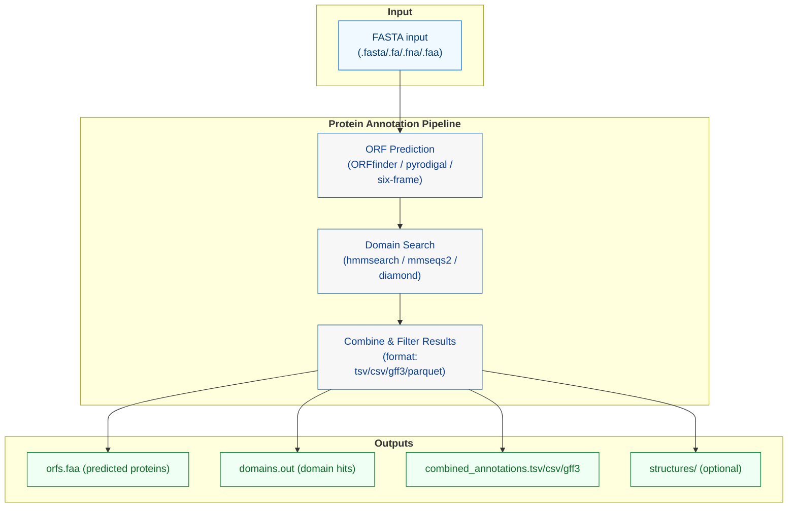

# Protein Annotation

!!! warning "🚧 Experimental"
    This command is implemented but still under active development.





## Annotate Protein

The `annotate-prot` command identifies coding sequences (ORFs) in viral genomes and predicts their protein functions through domain searches. The analysis includes:

- Open Reading Frame (ORF) prediction
- Protein domain identification
- Functional annotation
- Structural prediction (optional)

## Usage

```bash
rolypoly annotate-prot -i INPUT_FASTA -o OUTPUT_DIR [OPTIONS]
```

## Options

- `-i, --input`: Input fasta file or directory containing viral sequences (required)
- `-o, --output-dir`: Output directory path (default: `./annotate_prot_output`)
- `-t, --threads`: Number of threads (default: 1)
- `-g, --log-file`: Path to log file (default: `./annotate_prot_logfile.txt`)
- `-M, --memory`: Memory allocation in GB (default: "8gb")
- `-op, --override-parameters, --override-params`: JSON string of parameter overrides
- `-ss, --skip-steps`: Comma-separated list of steps to skip
- `-gp, --gene-prediction-tool`: ORF prediction method
- `-st, --search-tool`: Search backend (`hmmsearch`, `mmseqs2`, `diamond`)
- `-d, --domain-db`: Domain database(s) (comma-separated)
- `-ml, --min-orf-length`: Minimum ORF length in amino acids
- `-gc, --genetic-code`: Genetic code for translation
- `-e, --evalue`: E-value filter threshold
- `--db-create-mode`: Handling mode for custom DB directories (`auto`, `mmseqs`, `hmm`)
- `--output-format`: Output format for results (default: "tsv")
  - Options: "tsv", "csv", "gff3"
- `-rm, --resolve-mode`: How overlapping domain hits are resolved
- `-mo, --min-overlap-positions`: Minimum overlap positions used by resolve logic
- `--alignment-strings/--no-alignment-strings`: Include or omit alignment strings in output

## Tool Parameters

Default parameters can be overridden using `--override-parameters`:

```json
{
    "prodigal": {
        "min_length": 30,
        "genetic_code": 1
    },
    "hmmscan": {
        "E": 1e-5,
        "domE": 1e-5
    },
    "rpsblast": {
        "evalue": 1e-5
    }
}
```

## Output Files

The command generates several output files:

- `orfs.faa`: Predicted protein sequences in FASTA format
- `domains.out`: Domain search results
- `functions.tsv`: Functional annotations
- `structures/`: Directory containing structural predictions (if enabled)
- `combined_annotations.[tsv/csv/gff3]`: Combined results in the specified format

### GFF3 Output Format

When using GFF3 output format (`--output-format gff3`), the following fields are included:

1. sequence_id: The ID of the input sequence
2. source: The tool that generated the annotation
3. type: Feature type (e.g., "CDS", "domain")
4. start: Feature start position
5. end: Feature end position
6. score: E-value or other numerical score
7. strand: Strand orientation (+/-)
8. phase: Reading frame (0, 1, or 2)
9. attributes: Additional information including:
   - ID: Unique identifier for the feature
   - Name: Feature name or description
   - Parent: ID of the parent feature (for domains)
   - Note: Additional annotations

## Citations

### ORF Prediction
- **Prodigal**: https://doi.org/10.1186/1471-2105-11-119
- **ORFfinder**: https://www.ncbi.nlm.nih.gov/orffinder/
### Domain Search
- **HMMER**: https://doi.org/10.1371/journal.pcbi.1002195
- **Pfam**: https://doi.org/10.1093/nar/gkaa913
- **VOGDB**: https://doi.org/10.3390/v16081191
- **MMseqs2**: https://doi.org/10.1038/nbt.3988
- **DIAMOND**: https://doi.org/10.1038/nmeth.3176
- **PSI-BLAST**: https://doi.org/10.1093/nar/25.17.3389

<!-- ### Structural Prediction
- **AlphaFold2**: https://doi.org/10.1038/s41586-021-03819-2 -->
