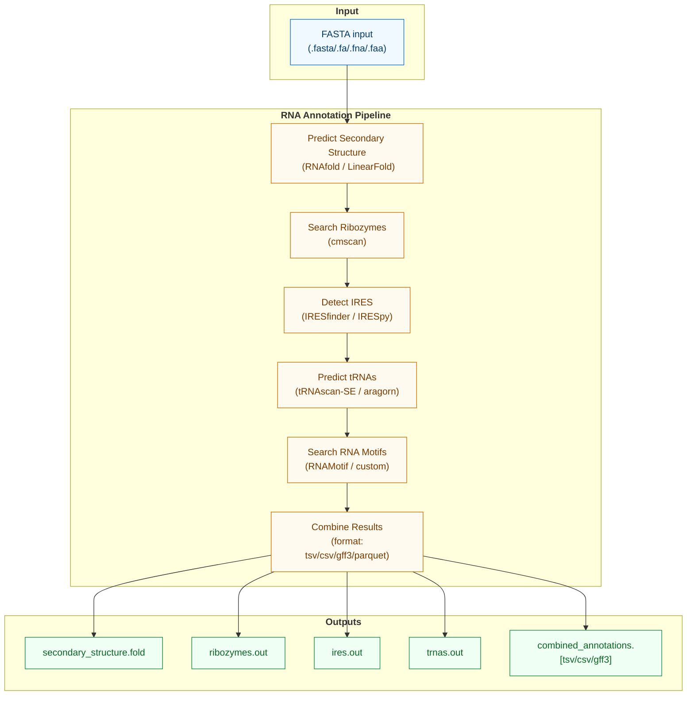

# RNA Annotation

!!! warning "🚧 Experimental"
    This command is implemented but still under active development.

## Annotate RNA

`annotate-rna` predicts RNA secondary structures and searches for various RNA elements in viral sequences, including:
- Secondary structure prediction
- Ribozyme identification
- IRES (Internal Ribosome Entry Site) detection
- tRNA prediction
- Other RNA structural elements



## Usage

```bash
rolypoly annotate-rna -i INPUT_FASTA -o OUTPUT_DIR [OPTIONS]
```

## Options

- `-i, --input`: Input nucleotide sequence file (required)
- `-o, --output-dir`: Output directory path (default: `./annotate_RNA_output`)
- `-t, --threads`: Number of threads (default: 1)
- `-g, --log-file`: Path to log file (default: `./annotate_RNA_logfile.txt`)
- `-l, --log-level`: Log level
- `-M, --memory`: Memory allocation in GB (default: "4gb")
- `-op, --override_parameters, --override-parameters`: JSON-like string of parameters to override tool settings
  - Example: `--override-parameters '{"RNAfold": {"temperature": 37}, "cmscan": {"E": 1e-5}}'`
- `--skip-steps`: Comma-separated list of steps to skip
  - Example: `--skip-steps RNAfold,cmsearch`
- `--secondary-structure-tool`: Tool for secondary structure prediction (default: "LinearFold")
  - Options: "RNAfold", "LinearFold"
  - Note: LinearFold is faster but less configurable
- `--ires-tool`: Tool for IRES identification (default: "IRESfinder")
  - Options: "IRESfinder", "IRESpy"
- `--trna-tool`: Tool for tRNA prediction (default: "tRNAscan-SE")
  - Options: "tRNAscan-SE", "aragorn"
- `--rnamotif-tool`: Tool for RNA motif identification
- `--cm-db`: Database for ribozyme search (default: "Rfam")
  - Options: "Rfam", "custom"
- `--custom-cm-db`: Path to custom CM database (required if --cm-db=custom)
- `--output-format`: Output format for combined results (default: "tsv")
  - Options: "tsv", "csv", "gff3"
- `--motif-db`: Motif database for RNA motif scanning
- `-rm, --resolve-mode`: How overlapping hits are resolved
- `-mo, --min-overlap-positions`: Minimum overlap positions used by resolve logic

## Tool Parameters

Default parameters for each tool can be overridden using `--override-parameters`:

```json
{
    "RNAfold": {
        "temperature": 25
    },
    "LinearFold": {
        
    },
    "RNAstructure": {
        "temperature": 25
    },
    "cmsearch": {
        "cut_ga": true,
        "noali": true
    },
    "IRESfinder": {
        "min_score": 0.5
    },
    "IRESpy": {
        "min_score": 0.6
    },
    "tRNAscan-SE": {
        "forceow": true,
        "G": true
    },
    "RNAMotif": {
        "min_score": 0.5
    },
    "aragorn": {
        "l": true
    }
}
```

## Output Files

The command generates several output files:

- `secondary_structure.fold`: RNA secondary structure predictions
- `ribozymes.out`: Identified ribozymes from cmscan
- `ires.out`: Predicted IRES elements
- `trnas.out`: Predicted tRNA sequences
- `rna_elements.out`: Other RNA structural elements
- `combined_annotations.[tsv/csv/gff3]`: Combined results in the specified format

### GFF3 Output Format

When using GFF3 output format (`--output-format gff3`), the following fields are included:

1. sequence_id: The ID of the input sequence
2. source: The tool that generated the annotation
3. type: Feature type (e.g., "tRNA", "IRES", "ribozyme")
4. start: Feature start position
5. end: Feature end position
6. score: Numerical score (if available)
7. strand: Strand orientation (+/-)
8. phase: Phase (for CDS features)
9. attributes: Additional information in key=value format

## Citations

### Secondary Structure Tools
- **RNAfold**: https://doi.org/10.1186/1748-7188-6-26
- **LinearFold**: https://doi.org/10.1093/bioinformatics/btz375

### IRES Detection
- **IRESfinder**: https://doi.org/10.1016/j.jgg.2018.07.006
- **IRESpy**: https://doi.org/10.1186/s12859-019-2999-7

### tRNA Prediction
- **tRNAscan-SE**: https://doi.org/10.1007/978-1-4939-9173-0_1
- **ARAGORN**: https://doi.org/10.1093/nar/gkh152

### RNA Element Search
- **Infernal/cmscan**: https://doi.org/10.1093/bioinformatics/btw271
- **Rfam Database**: https://doi.org/10.1093/nar/gkaa1047
- **RNAMotif**: https://doi.org/10.1093/nar/29.22.4724 