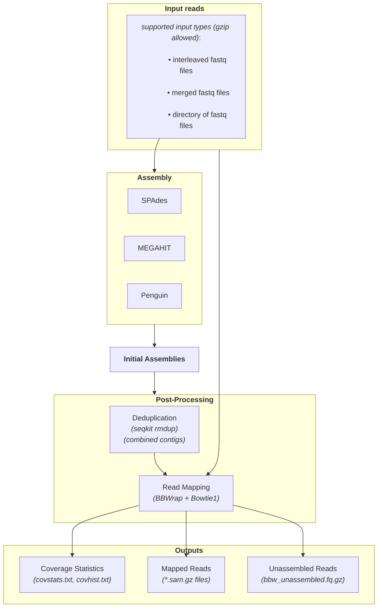

# Assembly

Description: Launches assemblers (user selected from SPAdes, MEGAHIT and Penguin, default is all), compute basic assembly statistics for each, merges the different assemblers contigs via linclust (i.e. reduces duplicates and contigs from one assembler wholly contained within a contigs from another tool), and finally filters the merged contigs based on user-defined parameters.

## Options
### Common
- `-id, --input-dir`: Input fastq files or directory (required)
- `-o, --output`: Output directory (default: "RP_assembly_output")
- `-t, --threads`: Number of threads (default: 1)
- `-M, --memory`: RAM limit (default: "6gb")
- `-g, --log-file`: Path to log file (default: current_directory/assemble_logfile.txt)
- `--keep-tmp`: Keep temporary files (flag)

### Assembly
- `-A, --assembler`: Assemblers to use (default: "spades,megahit,penguin")
- `--override-parameters`: JSON-like string to override defaults
- `--skip-steps`: Steps to skip (comma-separated)
- `--overwrite`: Overwrite existing output (flag)

### Default Parameters
Note: kmer lengths below are the max and min values Rolypoly will try, but it may reduce the range based on the data,to avoid errors (e.g. kmers longer the provided reads, too many kmers, or kmers of even number (if user overrides the default)).

#### SPAdes
- k-mer sizes: 21,33,45,57,63,69,71,83,95,103,107,111,119
- mode: meta

#### MEGAHIT
- k-min: 21
- k-max: 147
- k-step: 8
- min-contig-len: 30

#### Penguin
- min-contig-len: 150
- num-iterations: aa:1,nucl:12

#### BBWrap
- maxindel: 200
- minid: 90
- untrim: true
- ambig: best

## Skipable steps:
- `-ss, --skip-steps`: Steps to skip (comma-separated).  
options:
- `seqkit`: Deduplication (seqkit rmdup)
- `bbwrap`: for read mapping and assembly stats
- `bowtie`: for read mapping (sams).
<!-- - `mmseqs`: for read mapping (MMseqs2) -->
<!-- - `linclust`: for deduplication (Linclust) -->

## Downstream applications:
You can use rolypoly filter-contigs to remove contigs mapped to specific reference genome. This is useful for host DNA decontamination.

## Citations

### Assemblers
- **SPAdes**: Genome assembler
  - Citation: https://doi.org/10.1089/cmb.2012.0021

- **MEGAHIT**: Ultra-fast metagenome assembler
  - Citation: https://doi.org/10.1093/bioinformatics/btv033

- **Penguin**: Virus-aware assembler
  - Citation: https://doi.org/10.1101/2024.03.29.587318

### Support Tools
- **BBMap**: Read mapping and processing
  - Citation: https://sourceforge.net/projects/bbmap/files/BBMap_39.08.tar.gz

- **SeqKit**: Sequence manipulation
  - Citation: https://doi.org/10.1002/imt2.191

- **Bowtie**: Read mapping
  - Citation: https://doi.org/10.1186/gb-2009-10-3-r25 