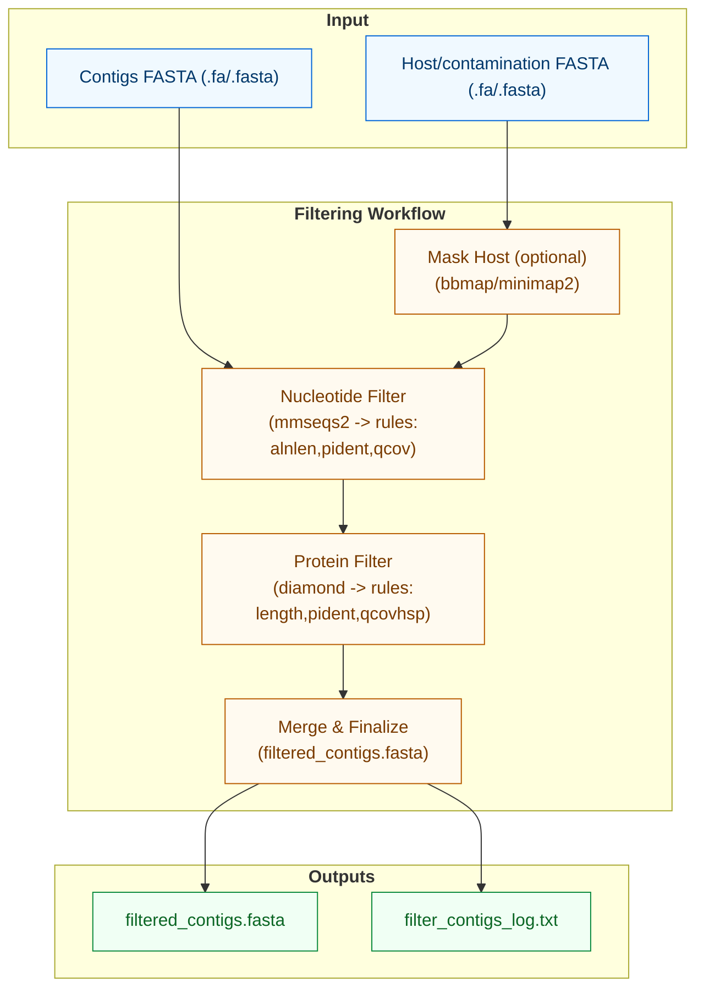

# Assembly Filtering

`filter-contigs` removes potential host and contamination sequences through nucleotide and protein-level comparisons.

## Options

### Common
- `-i, --input`: Input fasta file (required)
- `-o, --output`: Output file location (default: current_directory/filtered_contigs.fasta)
- `-t, --threads`: Number of threads (default: 1)
- `-M, --memory`: Memory allocation (default: "6g")
- `-g, --log-file`: Path to log file
- `--keep-tmp`: Keep temporary files (flag)

### Filtering
- `-m, --mode`: Operation mode: nuc, aa, or both (default: 'both')
- `-d, --known-dna, --host`: Host/contamination fasta file (required)
- `--dont-mask`: Skip masking RNA virus-like sequences in host fasta (flag)

### Nucleotide Filtering
- `-Fm1, --filter1_nuc`: First filter (default: "alnlen >= 120 & pident>=75")
- `-Fm2, --filter2_nuc`: Second filter (default: "qcov >= 0.95 & pident>=95")
- `--mmseqs-args`: Additional MMseqs2 arguments (default: "--min-seq-id 0.5 --min-aln-len 80")

### Protein Filtering
- `-Fd1, --filter1_aa`: First filter (default: "length >= 80 & pident>=75")
- `-Fd2, --filter2_aa`: Second filter (default: "qcovhsp >= 95 & pident>=80")
- `--diamond-args`: Additional Diamond arguments (default: "--id 50 --min-orf 50")

### Filter Variables
- Nucleotide: `alnlen`, `pident`, `qcov`
- Protein: `length`, `pident`, `qcovhsp`

## Citations

This command uses the following tools:

### Search Tools
- MMseqs2: https://doi.org/10.1038/nbt.3988
- DIAMOND: https://doi.org/10.1038/nmeth.3176

### Support Tools
- BBMap: https://sourceforge.net/projects/bbmap/files/BBMap_39.08.tar.gz
- pyrodigal: https://doi.org/10.21105/joss.04296
- pyfastx: https://doi.org/10.1093/bib/bbaa368 