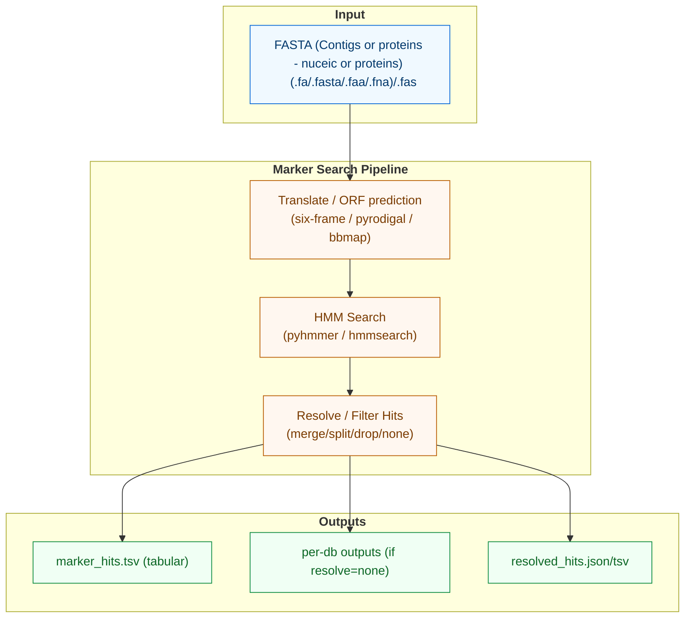

# Marker Gene Search

`marker-search` identifies RNA virus marker genes (primarily RNA-dependent RNA polymerase) in contigs using profile HMMs.

## Options

### Common
- `-i, --input`: Input fasta file (required)
- `-o, --output`: Output directory (default: current_directory/marker_search_out)
- `-t, --threads`: Number of threads (default: 1)
- `-M, --memory`: Memory limit (default: "6g")
- `-g, --log-file`: Path to log file (default: current_directory/marker_search_logfile.txt)
- `--keep-tmp`: Keep temporary files (flag)

### Search
- `-db, --database`: Database(s) to search (default: "NeoRdRp_v2.1,genomad")
  - Options include: NeoRdRp_v2.1, RdRp-scan, RVMT, Pfam_RTs_RdRp, genomad, all
  - You may also pass a custom path to an HMM file, HMM directory, or MSA directory
- `-ie, --inc-evalue`: Maximum e-value (default: 0.05)
- `-s, --score`: Minimum score (default: 20)
- `-am, --aa-method`: Translation strategy (`six_frame`, `pyrodigal`, `bbmap`)
- `-td, -tempdir, --temp-dir`: Temporary directory path

### Hit Resolution (Not Fully Implemented)
- `-rm, --resolve-mode`: Multiple profile match handling (default: "simple")
  - merge: Merge overlapping hits
  - one_per_range: One hit per range
  - one_per_query: One hit per query
  - split: Split overlapping domains
  - drop_contained: Drop contained hits
  - none: No overlap resolution
  - simple: Chain drop_contained with split
- `-mo, --min-overlap-positions`: Minimum overlap positions (default: 10)

## Citations

### Tools
- **pyhmmer**: Python HMMER bindings
  - Citation: https://doi.org/10.1093/bioinformatics/btad214

- **pyrodigal**: Python Prodigal-GV bindings
  - Citation: https://doi.org/10.21105/joss.04296

- **BBMap**: ORF prediction
  - Citation: https://sourceforge.net/projects/bbmap/files/BBMap_39.08.tar.gz

### Databases
- **NeoRdRp_v2.1**: RdRp profiles
  - Citation: https://doi.org/10.1264/jsme2.ME22001
  - GitHub: https://github.com/shoichisakaguchi/NeoRdRp

- **RdRp-scan**: RdRp profiles
  - Citation: https://doi.org/10.1093/ve/veac082
  - GitHub: https://github.com/JustineCharon/RdRp-scan
  - Note: Incorporates PALMdb (https://doi.org/10.7717/peerj.14055)

- **RVMT**: RNA Virus MetaTranscriptomes
  - Citation: https://doi.org/10.1016/j.cell.2022.08.023
  - GitHub: https://github.com/UriNeri/RVMT
  - Zenodo: https://zenodo.org/record/7368133

- **TSA_2018**: Transcriptome Shotgun Assembly
  - Citation: https://doi.org/10.1093/molbev/msad060
  - Data: https://drive.google.com/drive/folders/1liPyP9Qt_qh0Y2MBvBPZQS6Jrh9X0gyZ

- **Pfam_A_37**: Protein families
  - Citation: https://doi.org/10.1093/nar/gkaa913
  - Data: https://ftp.ebi.ac.uk/pub/databases/Pfam/releases/Pfam37.0/Pfam-A.hmm.gz
  - Note: RdRps and RT profiles: PF04197.17, PF04196.17, PF22212.1, PF22152.1, PF22260.1, PF05183.17, PF00680.25, PF00978.26, PF00998.28, PF02123.21, PF07925.16, PF00078.32, PF07727.19, PF13456.11 

- **geNomad**: Plasmid, virus, or host classification
  - Citation: https://doi.org/10.1038/s41587-023-01953-y
  - Data: https://doi.org/10.5281/zenodo.6994741
  - GitHub: https://github.com/apcamargo/genomad
  - Note: RNA virus marker proteins extracted from geNomad v1.9
