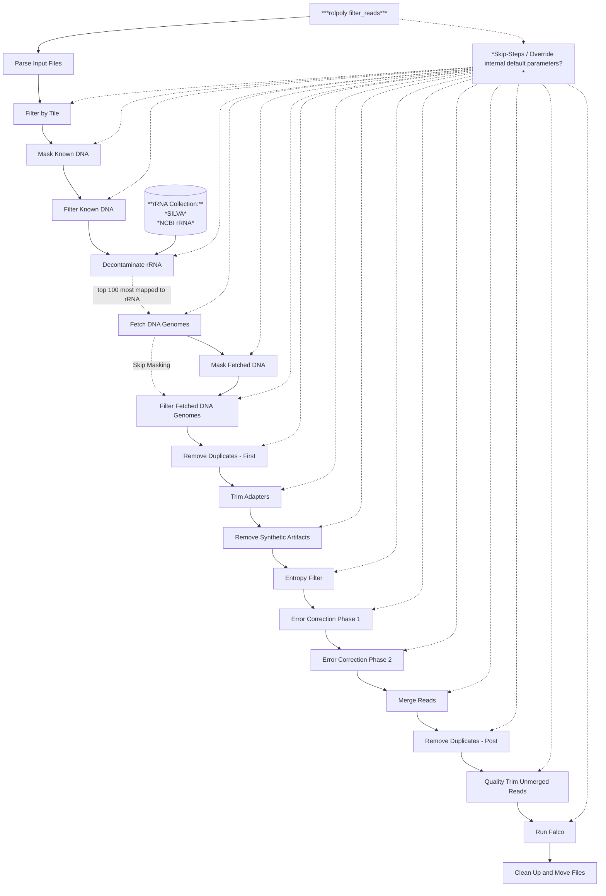

# Read Processing

`filter-reads` processes raw RNA-seq data to remove contaminants (rRNA, host, artifacts) and improve sequence quality.

## Options

### Common
- `-i, --input`: Input raw reads file(s) or directory (required)
- `-o, --output`: Output directory (default: current directory)
- `-t, --threads`: Number of threads (default: 1)
- `-M, --memory`: Memory allocation (default: "6gb")
- `-g, --log-file`: Path to log file (default: current_directory/rolypoly.log)
- `--keep-tmp`: Keep temporary files (flag)
- `--config-file`: Path to config file
- `--overwrite`: Overwrite existing output (flag)
- `--log-level`: Logging level

### Processing
- `-D, --known-dna`: Known DNA entities to filter out
- `-s, --speed`: BBDuk speed value (0-15, higher=faster but less sensitive) (default: 0)
- `--skip-existing`: Skip steps if output exists (flag)
- `--skip-steps`: Steps to skip (comma-separated)
- `--override-parameters`: JSON-like string to override step parameters
- `--step-timeout`: Timeout per step in seconds (default: 3600)
- `-n, --file-name`: Base name for output files (default: "rp_filtered_reads")

### Default Step Parameters
```json
{
    "filter_by_tile": {"nullifybrokenquality": "t"},
    "filter_known_dna": {"k": 31, "mincovfraction": 0.7, "hdist": 0},
    "decontaminate_rrna": {"k": 31, "mincovfraction": 0.5, "hdist": 0},
    "filter_identified_dna": {"k": 31, "mincovfraction": 0.7, "hdist": 0},
    "dedupe": {"dedupe": true, "passes": 1, "s": 0},
    "trim_adapters": {"ktrim": "r", "k": 23, "mink": 11, "hdist": 1, "tpe": "t", "tbo": "t", "minlen": 45},
    "remove_synthetic_artifacts": {"k": 31},
    "entropy_filter": {"entropy": 0.01, "entropywindow": 30},
    "error_correct_1": {"ecco": true, "mix": "t", "ordered": "t"},
    "error_correct_2": {"ecc": true, "reorder": true, "nullifybrokenquality": true, "passes": 1},
    "merge_reads": {"k": 93, "extend2": 80, "rem": true, "mix": "f"},
    "quality_trim_unmerged": {"qtrim": "rl", "trimq": 5, "minlen": 45}
}
```

### Processing Steps
1. Filter by Tile (Illumina)
2. Known DNA Filtering
3. rRNA Decontamination
4. DNA Genome Filtering
5. Deduplication
6. Adapter Trimming
7. Synthetic Artifact Removal
8. Entropy Filtering
9. Error Correction
10. Read Merging (paired-end)
11. Quality Trimming

### Input Types
- Single interleaved FASTQ
- Paired R1/R2 files (comma-separated)
- Directory of FASTQ files
  - Paired: share base name (sample_R1.fq, sample_R2.fq)
  - Single: treated as interleaved

## Usage

```bash
# Basic paired-end
rolypoly filter-reads -i reads_R1.fq,reads_R2.fq -o filtered/

# With parameters
rolypoly filter-reads -i reads.fq -D host.fa -s 5 --override-parameters '{"dedupe": {"passes": 2}}'
```

## Citations

This command uses the following tools and databases:

### Tools
- BBMap: https://sourceforge.net/projects/bbmap/files/BBMap_39.15.tar.gz
- SeqKit: https://doi.org/10.1002/imt2.191
- NCBI datasets: https://ftp.ncbi.nlm.nih.gov/pub/datasets/command-line/v2/linux-amd64/datasets

### Databases
- SILVA: https://doi.org/10.1093/nar/gks1219
- RefSeq: https://doi.org/10.1093%2Fnar%2Fgkv1189


## Output

- Filtered reads in FASTQ format
- Quality control reports
- Processing logs
- Temporary files (if --keep-tmp is specified)

## `rolypoly filter_reads`


