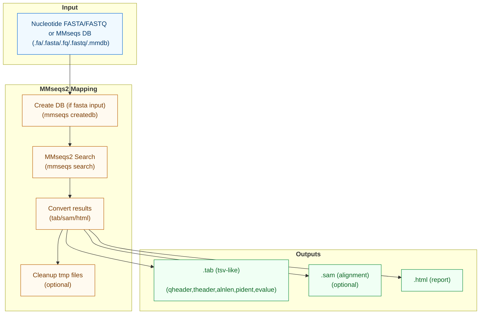

# Virus Search

`virus-mapping` maps reads or contigs against virus databases using MMseqs2.



## Options

### Common
- `-i, --input`: Input nucleotide fasta/fastq or MMseqs2 database (required)
- `-o, --output`: Output location (default: current_directory_RP_mapping)
- `-t, --threads`: Number of threads (default: 1)
- `-M, --memory`: Memory allocation (default: "6g")
- `-g, --log-file`: Path to log file (default: current_directory/search_viruses_logfile.txt)
- `--keep-tmp`: Keep temporary files (flag)

### Database
- `--db`: Database to search (default: "all")
  - Options: RVMT, NCBI_Ribovirus, all, other
- `--db-path`: Path to custom database (required if db is 'other')
  - Can be FASTA or formatted MMseqs2 database

## Usage

```bash
# Basic search against all databases
rolypoly virus-mapping -i contigs.fa -o virus_hits.tab

# Search against custom database
rolypoly virus-mapping -i reads.fq --db other --db-path custom_viruses.fa
```

## Citations

This command uses the following tools and databases:

### Tools
- MMseqs2: https://doi.org/10.1038/nbt.3988

### Databases
- RVMT: https://doi.org/10.1016/j.cell.2022.08.023
  - GitHub: https://github.com/UriNeri/RVMT
  - Zenodo: https://zenodo.org/record/7368133
- RefSeq: https://doi.org/10.1093%2Fnar%2Fgkv1189 