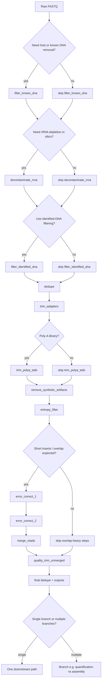

# Examples
Scenario-based examples for the most common RolyPoly workflows/commands.
Note - command help messages are updated on a more frequent basis, so for full option lists, run `rolypoly <command> --help`.

---

### Common in-silico steps mapped to `filter-reads`

The list below follows a common read-processing order and maps each stage to the internal
`filter-reads` step names. Each step includes examples for how to skip it (`--skip-steps`),
when it is skipped by presets, and/or how to tune behavior with `--override-parameters`.

#### Decision flow for read-processing branches



#### 1) Known DNA filtering: `filter_known_dna`

Used for host or known DNA contaminant subtraction when you provide `-D/--known-dna`.
If `--known-dna` is not provided, this step is automatically skipped.

```bash
# Use a custom known DNA reference
rolypoly filter-reads -i reads/ -o filtered/ \
  -D host_or_contaminant.fasta

# Skip known DNA filtering explicitly
rolypoly filter-reads -i reads/ -o filtered/ \
  --skip-steps filter_known_dna

# Tune matching strictness
rolypoly filter-reads -i reads/ -o filtered/ -D host.fasta \
  --override-parameters '{"filter_known_dna": {"k": 31, "mincovfraction": 0.8, "hdist": 0}}'
```

#### 2) rRNA decontamination: `decontaminate_rrna`

Uses packaged rRNA references (SILVA + NCBI masked sets).

```bash
# Default run (with rRNA filtering)
rolypoly filter-reads -i reads/ -o filtered/

# Skip rRNA filtering
rolypoly filter-reads -i reads/ -o filtered/ \
  --skip-steps decontaminate_rrna

# Also skipped by this preset
rolypoly filter-reads -i reads/ -o filtered/ \
  --preset all_virus_metag

# Make rRNA filtering stricter/looser
rolypoly filter-reads -i reads/ -o filtered/ \
  --override-parameters '{"decontaminate_rrna": {"mincovfraction": 0.7, "k": 31}}'
```

#### 3) Identified DNA filtering: `filter_identified_dna`

This step uses the rRNA stats profile to fetch candidate genomes and filter likely host/DNA reads.

```bash
# Run with identified-DNA filtering
rolypoly filter-reads -i reads/ -o filtered/

# Skip identified-DNA filtering
rolypoly filter-reads -i reads/ -o filtered/ \
  --skip-steps filter_identified_dna

# Already skipped by these presets
rolypoly filter-reads -i reads/ -o filtered/ --preset fast
rolypoly filter-reads -i reads/ -o filtered/ --preset all_virus_metat
rolypoly filter-reads -i reads/ -o filtered/ --preset all_virus_metag

# Tune filtering sensitivity
rolypoly filter-reads -i reads/ -o filtered/ \
  --override-parameters '{"filter_identified_dna": {"mincovfraction": 0.8, "k": 31}}'
```

#### 4) Deduplication (early pass): `dedupe`

`dedupe` appears here in the main processing chain, and another dedupe pass is run at final output stage.

```bash
# Skip the early dedupe stage in the main chain
rolypoly filter-reads -i reads/ -o filtered/ \
  --skip-steps dedupe

# Tune dedupe aggressiveness
rolypoly filter-reads -i reads/ -o filtered/ \
  --override-parameters '{"dedupe": {"passes": 1, "s": 0}}'

# strict preset increases dedupe aggressiveness
rolypoly filter-reads -i reads/ -o filtered/ --preset strict
```

#### 5) Adapter trimming: `trim_adapters`

Adapter trimming runs after early decontamination and before quality trimming.

```bash
# Skip adapter trimming (usually not recommended)
rolypoly filter-reads -i reads/ -o filtered/ \
  --skip-steps trim_adapters

# Tune adapter trim behavior
rolypoly filter-reads -i reads/ -o filtered/ \
  --override-parameters '{"trim_adapters": {"k": 23, "mink": 11, "hdist": 1, "minlen": 20}}'
# If you want to use only a known custom adapter set, pre-trim externally,
# then skip internal adapter trimming in rolypoly.
cutadapt -a file:my_adapters.fa -A file:my_adapters.fa \
  -o pretrim_R1.fq.gz -p pretrim_R2.fq.gz reads_R1.fq.gz reads_R2.fq.gz

rolypoly filter-reads -i pretrim_R1.fq.gz,pretrim_R2.fq.gz -o filtered/ \
  --skip-steps trim_adapters
```

#### 6) Poly-A tail trimming: `trim_polya_tails`

Useful for poly-A selected libraries; disabled by default unless preset/flag enables it.

```bash
# Enable poly-A tail trimming explicitly
rolypoly filter-reads -i reads/ -o filtered/ --trim-polya

# Also enabled by this preset
rolypoly filter-reads -i reads/ -o filtered/ --preset poly_a_selected

# Skip poly-A trimming
rolypoly filter-reads -i reads/ -o filtered/ \
  --skip-steps trim_polya_tails

# Tune poly-A trimming
rolypoly filter-reads -i reads/ -o filtered/ --trim-polya \
  --override-parameters '{"trim_polya_tails": {"trimpolya": 18, "minlen": 20}}'
```

#### 7) Synthetic artifact filtering: `remove_synthetic_artifacts`

Targets synthetic/control artifacts.

```bash
# Skip synthetic artifact filtering
rolypoly filter-reads -i reads/ -o filtered/ \
  --skip-steps remove_synthetic_artifacts

# Tune k-mer matching
rolypoly filter-reads -i reads/ -o filtered/ \
  --override-parameters '{"remove_synthetic_artifacts": {"k": 31}}'
```

#### 8) Low-complexity filtering: `entropy_filter`

Filters very low-complexity reads (mostly homopolymers / low-entropy sequence).

```bash
# Skip entropy filtering
rolypoly filter-reads -i reads/ -o filtered/ \
  --skip-steps entropy_filter

# Tune entropy thresholds
rolypoly filter-reads -i reads/ -o filtered/ \
  --override-parameters '{"entropy_filter": {"entropy": 0.01, "entropywindow": 30}}'
```

#### 9) Overlap-based correction stage 1: `error_correct_1`

Most useful when paired reads overlap (short inserts). On single-end input, this step is auto-skipped.

```bash
# Skip stage 1 correction
rolypoly filter-reads -i reads/ -o filtered/ \
  --skip-steps error_correct_1

# fast preset already skips error_correct_1
rolypoly filter-reads -i reads/ -o filtered/ --preset fast

# Tune stage 1 behavior
rolypoly filter-reads -i reads/ -o filtered/ \
  --override-parameters '{"error_correct_1": {"mix": "t", "ordered": "t"}}'
```

#### 10) Correction stage 2: `error_correct_2`

Second correction stage. This one is not auto-skipped for single-end by default.

```bash
# Skip stage 2 correction
rolypoly filter-reads -i reads/ -o filtered/ \
  --skip-steps error_correct_2

# fast preset already skips error_correct_2
rolypoly filter-reads -i reads/ -o filtered/ --preset fast

# Tune stage 2 behavior
rolypoly filter-reads -i reads/ -o filtered/ \
  --override-parameters '{"error_correct_2": {"passes": 1, "reorder": true}}'
```

#### 11) Overlap merge: `merge_reads`

Merges overlapping pairs. Auto-skipped for single-end input.

```bash
# Skip merge stage
rolypoly filter-reads -i reads/ -o filtered/ \
  --skip-steps merge_reads

# Tune merge behavior
rolypoly filter-reads -i reads/ -o filtered/ \
  --override-parameters '{"merge_reads": {"mix": "f"}}'
```

#### 12) Quality trimming of unmerged reads: `quality_trim_unmerged`

Late-stage quality trimming after correction/merge steps.

```bash
# Skip quality trimming
rolypoly filter-reads -i reads/ -o filtered/ \
  --skip-steps quality_trim_unmerged

# Tune trim stringency
rolypoly filter-reads -i reads/ -o filtered/ \
  --override-parameters '{"quality_trim_unmerged": {"trimq": 12, "minlen": 25}}'
```

#### Final output stage note

After the main chain above, `filter-reads` runs a final dedupe pass on merged/interleaved outputs.

---

### Preset quick-reference

| `roll` preset | Library preparation | Filter preset | Assembly preset |
|---|---|---|---|
| `rna_virus` (default) | RNA virus metatranscriptome: rRNA removal, host + identified-DNA filter | `rna_virus_metat` | `rna_virus` |
| `ribodepleted` | Total RNA ribo-depleted: stricter rRNA removal (mincovfraction=0.7) | `total_rna_ribodepleted` | `rna_virus` |
| `poly_a` | Poly-A selected mRNA: polyA tail trim, stricter quality trim | `poly_a_selected` | `metatranscriptome` |
| `all_virus_metat` | All-virus metatranscriptome / RNA virome: relaxed rRNA filter, skips identified-DNA filter | `all_virus_metat` | `rna_virus` |
| `DNA_virus` | DNA virome / metagenomics: skips rRNA and identified-DNA filtering | `all_virus_metag` | `metag` (metaSPAdes only) |
| `complete` | Any — maximum sensitivity; runs all three assembler modes | `rna_virus_metat` | `complete` |
| `fast` | Any — quick preview; skips error correction and identified-DNA filter | `fast` | `fast` |

When unsure, start with `--preset rna_virus`. Check read-count retention in the log before committing
to a full run on many samples.

---

## End-to-end pipeline (`roll`)

The `roll` command runs the full discovery pipeline in one call:
read filtering → assembly → contig filtering → marker search → nucleotide search → annotation.
Pick the `--preset` that matches your library preparation.

### Viral RNA metatranscriptome (default)

Ribo-depleted total RNA from an environmental sample; expected to contain RNA viruses.
This is the default preset, so `--preset rna_virus` can be omitted.

```bash
rolypoly roll \
  --input reads_R1.fq.gz,reads_R2.fq.gz \
  --output-dir rp_out/ \
  --threads 16 --memory 64g \
  --preset rna_virus
```

### With host/contaminant removal

Provide a FASTA of the host genome (or any expected DNA contaminant) with `-D`.
The assembly step will also filter contigs that match the host.

```bash
rolypoly roll \
  --input reads_R1.fq.gz,reads_R2.fq.gz \
  --output-dir rp_out/ \
  --threads 16 --memory 64g \
  --preset rna_virus \
  --host host_genome.fasta
```

### Total RNA, ribo-depleted library

Use `ribodepleted` for stricter rRNA removal (mincovfraction=0.7).

```bash
rolypoly roll \
  --input reads/ \
  --output-dir rp_out/ \
  --threads 16 --memory 64g \
  --preset ribodepleted
```

### Poly-A selected mRNA library

Enables polyA tail trimming and uses rnaSPAdes+MEGAHIT assembly.

```bash
rolypoly roll \
  --input reads_R1.fq.gz,reads_R2.fq.gz \
  --output-dir rp_out/ \
  --threads 16 --memory 64g \
  --preset poly_a
```

### DNA virome / metagenomics (no rRNA or identified-DNA filtering)

Suitable for DNA-based viromes or metagenomic libraries where you do not want rRNA or identified-DNA filtering applied.  
NOTE: this isn't really rolypoly forte, this preset is just for convenience if you want to run a general pipeline that WON'T remove DNA data, or harm assembly of potential hosts.

```bash
rolypoly roll \
  --input reads/ \
  --output-dir rp_out/ \
  --threads 16 --memory 64g \
  --preset DNA_virus
```

### Maximum sensitivity

Runs all three assembler modes (metaSPAdes + rnaviralSPAdes + MEGAHIT).
Slowest, but highest chance of recovering divergent or low-abundance viruses.

```bash
rolypoly roll \
  --input reads_R1.fq.gz,reads_R2.fq.gz \
  --output-dir rp_out/ \
  --threads 32 --memory 128g \
  --preset complete
```

### Quick preview with `--mini`

Subsamples the input before running the pipeline; forces the `fast` assembly preset.
Useful for a rapid sanity-check before committing to a full run.

```bash
rolypoly roll \
  --input reads_R1.fq.gz,reads_R2.fq.gz \
  --output-dir rp_preview/ \
  --threads 8 --memory 16g \
  --preset rna_virus \
  --mini
```

### Override individual sub-presets

Use `--filter-preset` and/or `--assembly-preset` to mix-and-match independently of `--preset`.

```bash
# Strict read filtering, but fast assembly
rolypoly roll \
  --input reads/ \
  --output-dir rp_out/ \
  --filter-preset strict \
  --assembly-preset fast
```

### Resume a partial run
WARNING ! THIS IS NOT FULLY TESTED YET. Use at your own risk.
`--skip-existing` skips any step whose output directory already exists.

```bash
rolypoly roll \
  --input reads_R1.fq.gz,reads_R2.fq.gz \
  --output-dir rp_out/ \
  --preset rna_virus \
  --skip-existing
```

---

## Read filtering (`filter-reads`)

### Paired-end reads, default settings

```bash
rolypoly filter-reads \
  -i reads_R1.fq.gz,reads_R2.fq.gz \
  -o filtered_reads/ \
  -t 8 -M 16g
```

### Directory of FASTQ files

All FASTQ files in the directory are processed; paired files are matched by base name.

```bash
rolypoly filter-reads \
  -i raw_reads/ \
  -o filtered_reads/ \
  -t 8
```

### With a preset

```bash
# RNA virus metatranscriptome (lenient quality trim, rRNA removal at mincovfraction=0.6)
rolypoly filter-reads -i reads/ -o filtered/ --preset rna_virus_metat

# Total RNA ribo-depleted (stricter rRNA removal mincovfraction=0.7)
rolypoly filter-reads -i reads/ -o filtered/ --preset total_rna_ribodepleted

# Poly-A selected library (enables polyA trimming, stricter quality trim)
rolypoly filter-reads -i reads/ -o filtered/ --preset poly_a_selected

# All-virus metatranscriptome (relaxed rRNA filter, skips identified-DNA filter)
rolypoly filter-reads -i reads/ -o filtered/ --preset all_virus_metat

# All-virus metagenomics (skip rRNA + identified-DNA filters entirely)
rolypoly filter-reads -i reads/ -o filtered/ --preset all_virus_metag

# Fast (skip error correction and identified-DNA filter)
rolypoly filter-reads -i reads/ -o filtered/ --preset fast
```

### With host removal

```bash
rolypoly filter-reads \
  -i reads_R1.fq.gz,reads_R2.fq.gz \
  -o filtered_reads/ \
  -D host_genome.fasta \
  --preset rna_virus_metat
```

### Override a specific step parameter

```bash
# Raise rRNA coverage threshold and use a stricter quality trim
rolypoly filter-reads \
  -i reads/ -o filtered/ \
  --preset rna_virus_metat \
  --override-parameters '{"decontaminate_rrna": {"mincovfraction": 0.8}, "quality_trim_unmerged": {"trimq": 15}}'
```

### Skip specific steps

```bash
# Run everything except error correction
rolypoly filter-reads \
  -i reads/ -o filtered/ \
  --skip-steps error_correct_1 --skip-steps error_correct_2
```

---

## Assembly (`assemble`)

### From a directory of filtered reads, default settings

```bash
rolypoly assemble \
  -id filtered_reads/ \
  -o assembly_out/ \
  -t 16 -M 64g
```

### With a preset

```bash
# RNA virus: rnaviralSPAdes + MEGAHIT, broad k-mer range, rmdup post-processing
rolypoly assemble -id filtered_reads/ -o assembly_out/ --preset rna_virus

# Metatranscriptome: rnaSPAdes + MEGAHIT
rolypoly assemble -id filtered_reads/ -o assembly_out/ --preset metatranscriptome

# Metagenomics: metaSPAdes (for DNA-based libraries)
rolypoly assemble -id filtered_reads/ -o assembly_out/ --preset metag

# Fast: MEGAHIT only, narrow k-mer range
rolypoly assemble -id filtered_reads/ -o assembly_out/ --preset fast

# Complete: all three assembler modes
rolypoly assemble -id filtered_reads/ -o assembly_out/ --preset complete
```

### Explicit library specification

```bash
# Paired-end
rolypoly assemble \
  --paired-end 1 reads_R1.fq.gz reads_R2.fq.gz \
  -o assembly_out/ -t 8 -M 32g

# Multiple libraries mixed
rolypoly assemble \
  --paired-end 1 lib1_R1.fq.gz lib1_R2.fq.gz \
  --merged 2 lib2_merged.fq.gz \
  -o assembly_out/ -t 8 -M 32g
```

### Run only rnaviralSPAdes

```bash
rolypoly assemble \
  -id filtered_reads/ \
  -o assembly_out/ \
  -A spades_rnaviral
```

### Override k-mer settings

```bash
rolypoly assemble \
  -id filtered_reads/ -o assembly_out/ \
  --preset rna_virus \
  --override-parameters '{"megahit": {"k-min": 27, "k-max": 99, "k-step": 12}}'
```

### Skip post-processing deduplication

```bash
rolypoly assemble \
  -id filtered_reads/ -o assembly_out/ \
  --preset rna_virus \
  --skip-steps post_processing
```

---

## Modular step-by-step workflow

The `roll` command chains these steps automatically, but each can be run independently
for finer control or to slot into an existing pipeline.

```bash
# 1. Filter reads
rolypoly filter-reads \
  -i raw_reads/ -o filtered_reads/ \
  -t 16 -M 32g --preset rna_virus_metat

# 2. Assemble
rolypoly assemble \
  -id filtered_reads/ -o assembly/ \
  -t 16 -M 64g --preset rna_virus

# 3. Filter assembled contigs against a host reference
rolypoly filter-contigs \
  -i assembly/final_assembly.fasta \
  --host host_genome.fasta \
  -o assemblies/filtered_assembly.fasta \
  -t 8

# 4. Search for viral marker genes (RdRps, genomad)
rolypoly marker-search \
  -i assemblies/filtered_assembly.fasta \
  -o marker_results/ \
  -t 16

# 5. Nucleotide-level search against known RNA virus databases
rolypoly nucleic-search \
  -i assemblies/filtered_assembly.fasta \
  -o virus_hits.tab \
  -t 16

# 6. Annotate candidate contigs
rolypoly annotate \
  -i assemblies/filtered_assembly.fasta \
  -o annotation/ \
  -t 16
```

---

## Marker gene search (`marker-search`)

```bash
# Search all supported databases (RdRp HMMs + geNomad)
rolypoly marker-search \
  -i contigs.fasta -o marker_out/ -t 8

# Search only the RdRp database
rolypoly marker-search \
  -i contigs.fasta -o marker_out/ --database rdrp -t 8
```

## Virus nucleotide search (`nucleic-search`)

```bash
rolypoly nucleic-search \
  -i contigs.fasta \
  -o virus_hits.tab \
  -t 8

# Multiple sequence files can be comma-separated; a directory is also accepted
rolypoly nucleic-search \
  -i sample_1_contigs.fasta,sample_2_contigs.fasta \
  -o combined_virus_hits.tab \
  -t 8

# Preserve paired-read evidence when mapping reads back to candidate contigs
rolypoly map \
  --reference candidate_contigs.fasta \
  --paired-end 1 reads_R1.fastq.gz reads_R2.fastq.gz \
  --mapper bbmap \
  --concordant \
  --output candidate_read_mapping
```

## Shrink / subsample reads

```bash
# Random subsample to 50 000 reads (for a quick test)
rolypoly shrink-reads \
  -i reads_R1.fq.gz,reads_R2.fq.gz \
  -o sampled/ \
  --subset-type random --sample-size 50000

# Coverage-normalise with bbnorm (better for paired data)
rolypoly shrink-reads \
  -i reads_R1.fq.gz,reads_R2.fq.gz \
  -o sampled/ \
  --subset-type bbnorm
```
