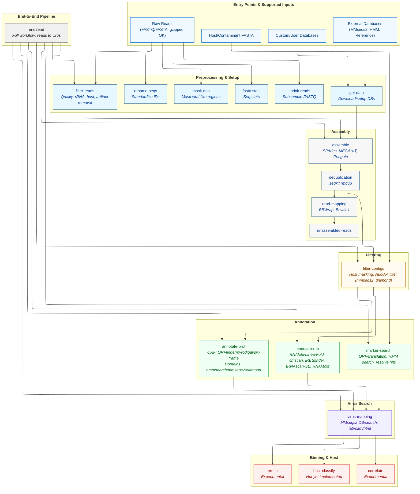

# RolyPoly Documentation

!!! warning "🚧 Experimental"
    RolyPoly is under active development - features may be incomplete or experimental.

## Quick Start

RolyPoly offers two installation approaches:

**Quick and Easy** (recommended for most users): One conda environment with all tools.  
**Modular/Dev** (for developers): Command-specific environments to avoid dependency conflicts.

```bash
# Option 1: Quick and Easy - One environment for everything
curl -O https://code.jgi.doe.gov/rolypoly/rolypoly/-/raw/main/src/setup/quick_setup.sh && bash quick_setup.sh

# Option 2: Modular/Dev - Install only what you need
curl -fsSL https://pixi.sh/install.sh | bash  # Install pixi first
git clone https://code.jgi.doe.gov/rolypoly/rolypoly.git && cd rolypoly
pixi install -e reads-only      # Just read processing
pixi install -e assembly-only   # Just assembly tools
pixi install -e complete        # All functionality

# Get started
pixi run -e complete rolypoly --help
```

For detailed installation options, see the [installation guide](installation.md).

## About

RolyPoly is an RNA virus analysis toolkit*. 
*Toolkit- includes a variety of commands, parsers, wrappers for external tools, automations, and some "quality of life" fuinctions for many steps of a virus investigation process (from raw read processing to genome annotation, and back again).   
It also includes an "end-2-end" command that employs an entire pipeline, but I recommend u.sing it first to explore your data, optimise tool specific steps and parameters, or "plug" holes - missing steps in your existing workflow.


## Motivation / Goals  
There are many fine existing bioinfo virus analysis workflows and tools (See: [awesome-rna-virus-tools](https://github.com/rdrp-summit/awesome-rna-virus-tools)). IMO they all have legit use cases. However, they are often specific to certain research niches and can cause users to become somewhat "locked-in" as these workflows may not "communicate" or interopearte very well. Many researhers (espiceally wet lab or "data generators") don't not have the time and capcity to write custom analysis pipelines that have their own research interests in mind, which means they might compromise and pick an off-the-shelve tool, and drop certain analyses from their plan. RolyPoly is not aiming to be a finite replacement for any workflow, instead our aim are to bridge existing tools and steps in the investigation, by allowing many entry points (to most different steps) and support for different file formats and notations. Generally, the two main goals are:

### ⛑️ "wet lab approved/safe"
Help non-computational researchers take a deep dive into their data without compromising on using tools that are non-techie friendly, or that don't quite answer their specific needs.

### 🔌 "plug into your own"
Help (software) developers of virus analysis pipeline "plug" holes missing from their framework, by using specific RolyPoly commands to add features to their existing code base.  
See this [presentation](https://docs.google.com/presentation/d/155pc_4T6QoAgADP_0T20DuiSfweOW0LIzxZlxHiodvY/edit?usp=sharing) for more details.


## Overview - entry points, inputs, output points

!!! warning "🚧 Under Development 🚧"



## Contribution
All help is welcome! If you would like to contribute to RolyPoly, whether it's code, documentation, testing, or suggestions, please check out our [contribution guidelines](contribute.md) 


## Related projects:  

- [RdRp-CATCH](https://github.com/dimitris-karapliafis/RdRpCATCH) - Collaborative benchmarking of public pHMMs.
- [Suvtk](https://github.com/LanderDC/suvtk) : Sreamlines preparing NCBI submissions
- [RdRp-Summit](https://rdrp.io/) - Open community for all things RNA virus discovery/investigation.
- [gff2parquet](https://github.com/UriNeri/gff2parquet) - convert gff3 annotations to parquet format for faster processing.
- [awesome-rna-virus-tools](https://github.com/rdrp-summit/awesome-rna-virus-tools) - A curated list of RNA virus analysis tools and resources.


## Authors
- Uri Neri
- Brian Bushnell
- Simon Roux
- Antônio Pedro de Castello Branco da Rocha Camargo
- Andrei Stecca Steindorff
- Clement Coclet
- Frederik Schulz
- Dimitris Karapliafis
- David Parker
- ...
 
### Contact
Uri Neri or Simon Roux.


## Acknowledgments
Thanks to the DOE Joint Genome Institute for infrastructure support.
Special thanks to all contributors who have offered insights and
improvements.


## License and Copyright
RolyPoly is licensed under the GNU General Public License v3, for more information and copy right notice please see the main README.md file:  
https://code.jgi.doe.gov/rolypoly/rolypoly#copyright-notice  
https://code.jgi.doe.gov/rolypoly/rolypoly#license-agreement


## Citation
We hope to publish or have a preprint before 2026. If you use RolyPoly before hand, we suggest mentioning the exact commit tag you used, and cite RolyPoly as follows:

    Neri, U., Bushnell, B., Roux, S., & Camargo, A. P., Steindorff, A.S., Coclet, C., Parker, D., ... (2024). RolyPoly - "swiss-army knife" toolkit for RNA virus discovery and characterization [Software]. Available from https://code.jgi.doe.gov/UNeri/rolypoly

For specific versions or updates, please check the project repository
for the most current citation information.  
