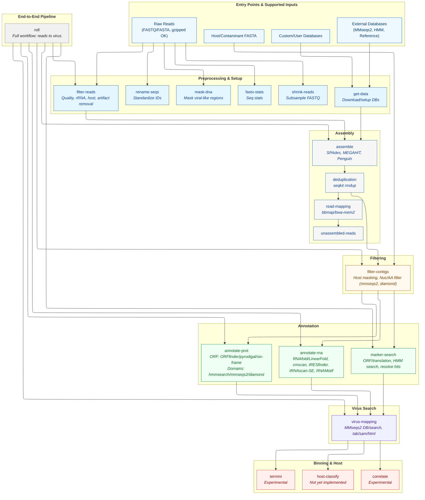

# RolyPoly Documentation

    

RolyPoly is an RNA virus analysis toolkit, meant to be a "swiss-army knife" for RNA virus discovery and characterization by including a variety of commands, wrappers, parsers, automations, and some "quality of life" features for any many of a virus investigation process (from raw read processing to genome annotation). While it includes an "end-2-end" command that employs an entire pipeline, the main goals of rolypoly are:

- Help non-computational researchers take a deep dive into their data without compromising on using tools that are non-techie friendly.  
- Help (software) developers of virus analysis pipeline "plug" holes missing from their framework, by using specific RolyPoly commands to add features to their existing code base.

## Note - Rolypoly is still under development (contributions welcome!)
RolyPoly is an open, rolling-release, still in progress project. We hope to summarise the main functionality into a manuscript ~late 2026. Pull requests and contributions are welcome and will be considered (see [contribute.md](contribute.md)).

## Overview - entry points, inputs, output points

!!! warning "🚧 Under Development 🚧"

```mermaid
---
config:
  layout: elk
  fontFamily: Arial
  themeVariables:
    fontFamily: Arial
---
graph TB
 subgraph INPUTS["<b>Entry Points &amp; Supported Inputs</b>"]
        RAWREADS["Raw Reads<br>(FASTQ/FASTA, gzipped OK)"]
        EXTDB["External Databases<br>(MMseqs2, HMM, Reference)"]
        HOSTFA["Host/Contaminant FASTA"]
        CUSTOMDB["Custom/User Databases"]
  end
 subgraph PREP["<b>Preprocessing &amp; Setup</b>"]
      GETDATA["get-data<br><i>Download/setup DBs</i>"]
      READPROC["filter-reads<br><i>Quality, rRNA, host, artifact removal</i>"]
        SHRINK["shrink-reads<br><i>Subsample FASTQ</i>"]
        MASKDNA["mask-dna<br><i>Mask viral-like regions</i>"]
        RENSEQ["rename-seqs<br><i>Standardize IDs</i>"]
        FASTXSTATS["fastx-stats<br><i>Seq stats</i>"]
  end
 subgraph ASM["<b>Assembly</b>"]
      ASSEMBLY["assemble<br><i>SPAdes, MEGAHIT, Penguin</i>"]
        DEDUP["deduplication<br><i>seqkit rmdup</i>"]
        MAPPING["read-mapping<br><i>bbmap/bwa-mem2</i>"]
        UNASSEMBLED["unassembled-reads"]
  end
 subgraph FILTER["<b>Filtering</b>"]
      FILTASM["filter-contigs<br><i>Host masking, Nuc/AA filter (mmseqs2, diamond)</i>"]
  end
 subgraph ANNO["<b>Annotation</b>"]
        ANPROT["annotate-prot<br><i>ORF: ORFfinder/pyrodigal/six-frame<br>Domains: hmmsearch/mmseqs2/diamond</i>"]
        ANRNA["annotate-rna<br><i>RNAfold/LinearFold, cmscan, IRESfinder, tRNAscan-SE, RNAMotif</i>"]
        MARKER["marker-search<br><i>ORF/translation, HMM search, resolve hits</i>"]
  end
 subgraph VIRUS["<b>Virus Search</b>"]
      SEARCHV["virus-mapping<br><i>MMseqs2 DB/search, tab/sam/html</i>"]
  end
 subgraph BINHOST["<b>Binning &amp; Host</b>"]
      BINCORR["correlate<br><i>Experimental</i>"]
      BINTERM["termini<br><i>Experimental</i>"]
        HOSTCL["host-classify<br><i>Not yet implemented</i>"]
  end
 subgraph E2E["<b>End-to-End Pipeline</b>"]
      roll["roll<br><i>Full workflow: reads to virus</i>"]
  end
    RAWREADS --> READPROC & SHRINK & MASKDNA & RENSEQ & FASTXSTATS
    EXTDB --> GETDATA
    CUSTOMDB --> GETDATA
    GETDATA --> ASSEMBLY
    READPROC --> ASSEMBLY
    ASSEMBLY --> DEDUP
    DEDUP --> MAPPING & FILTASM
    MAPPING --> UNASSEMBLED
    HOSTFA --> FILTASM
    FILTASM --> ANPROT & ANRNA & MARKER
    ANPROT --> SEARCHV
    ANRNA --> SEARCHV
    MARKER --> SEARCHV
    SEARCHV --> BINCORR & BINTERM & HOSTCL
    roll --> READPROC & ASSEMBLY & FILTASM & ANPROT & ANRNA & MARKER & SEARCHV
     RAWREADS:::inputStyle
     EXTDB:::inputStyle
     HOSTFA:::inputStyle
     CUSTOMDB:::inputStyle
     GETDATA:::preStyle
     READPROC:::preStyle
     SHRINK:::preStyle
     MASKDNA:::preStyle
     RENSEQ:::preStyle
     FASTXSTATS:::preStyle
     ASSEMBLY:::asmStyle
     DEDUP:::asmStyle
     MAPPING:::asmStyle
     UNASSEMBLED:::asmStyle
     FILTASM:::filtStyle
     ANPROT:::annoStyle
     ANRNA:::annoStyle
     MARKER:::annoStyle
     SEARCHV:::virusStyle
     BINCORR:::binStyle
     BINTERM:::binStyle
     HOSTCL:::binStyle
     roll:::e2eStyle
    classDef inputStyle fill:#f0f9ff,stroke:#0366d6,color:#03396c
    classDef preStyle fill:#e6f7ff,stroke:#2b5f8a,color:#0b3d91
    classDef asmStyle fill:#f7f7f7,stroke:#2b5f8a,color:#0b3d91
    classDef filtStyle fill:#fffaf0,stroke:#b85c00,color:#7a3b00
    classDef annoStyle fill:#f0fff4,stroke:#0b8a3e,color:#0b6624
    classDef virusStyle fill:#f0f0ff,stroke:#6c36d6,color:#3d1c91
    classDef binStyle fill:#fff0f0,stroke:#d63636,color:#910b0b
    classDef e2eStyle fill:#f0f0f0,stroke:#888888,color:#222222

```
