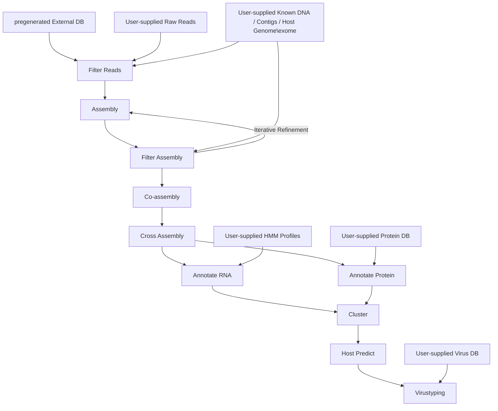

# Workflow

!!! warning "🚧 Under Development 🚧"
    RolyPoly is actively under development. Some workflow steps may be incomplete, experimental, or not fully documented. Please check the code or contact the developers for the most up-to-date information.

====================

The end-2-end command employs most of RolyPoly's commands and generally
follows this flow:

Pre-assembly
------------

1. The user supplied host genome is masked for kmers shared with known RNA viruses, and then used to filter reads mapping to it, followed by standard QA read processing (adapter trimming, overlapping PE read merging, quality filtering, error correction and read deduplication).
2. The input reads are filtered against an rRNA collection (SILVA + NCBI RefSeq rRNAs). Depending on the input (i.e. metagenomic or not, rRNA depletion efficiency, polyA selection, etc), this step can remove 5-97% of the data.
3. Based on the rRNA stats file, the top genomes from NCBI that had the highest percentage of mapped reads are fetched, masked to remove kmers shared with known RNA viruses, and used to further filter the input reads.
4. Run Falco to generate an HTML report.

Assembly
--------

1. Perform assembly using metaSpades, penguin, and/or megahit. Assembly graphs are saved if possible.
2. Assembly stats (N50, total length, number of contigs, etc) are saved in `run_info/assembly_stats.txt`.
3. The user supplied known DNA is masked and used to scrub the assemblies.
4. The scrubbed assemblies are merged and clustered to remove redundancy and remove contigs contained within other ones.
5. The original, non filtered, raw reads are mapped to the assembly to generate a SAM file.

Post-assembly
-------------

1. Run RdRp_pyhmmsearch using a collection of public databases, against the six-frames end to end translations of all contigs.
2. Search (nucleotide) all assembled contigs against a collection of virus genome databases.
3. Identify and extract 5' and 3' UTRs for each RdRp-positive or virus matching contig.
4. Combine all RdRp and ref virus matched contigs for annotation.

### Implementation Status

Currently implemented:
- ✅ Read filtering and quality control
- ✅ Assembly with multiple assemblers
- ✅ Marker gene search with pyhmmer (mostly RdRps)
- ✅ RNA structure annotation
- ✅ Assembly filtering and clustering

Under development:
- 🚧 Protein annotation
- 🚧 Host prediction
- 🚧 Genome binning and refinement
- 🚧 Life-style prediction
- 🚧 Cross-sample analysis

### Suggested Downstream Analysis

For multi-sample data:
1. Combine all RdRp and ref virus matched contigs from all samples
2. Perform a de novo co-assembly on the combined filtered fastq files
3. Perform a "cross-sample" assembly using all contigs from different single-sample assemblies
4. Search for ORFs in all RdRp-positive contigs
5. Examine RdRp-positive contigs for potential circularity
6. Search for other contigs/reads that contain/match the UTR collection

### Resource Usage

Different steps in the pipeline have different memory requirements and CPU utilization patterns. For detailed information about resource usage across different data types and commands, see the [resource-usage](./resource_usage.md) section.

Downstream and Summary report:
-------------
1. Annotation of the contigs via homology searches to large protein domain databases.
2. Crude phylogenetic placement and rough taxonomic assignment. 
3. Genome completeness estimation and attempted phenotypic prediction based on the annotation labels and consistency and granularity of available literature to the proposed  phylogenetic placement.
4. Using existing tools produce a user-friendly visual report, containing the software parameters used, and details regarding the identified genomes.

### Order of Execution
TODO: actually write this graph:

 The process starts with preparing the external database and proceeds through various stages of filtering, assembly, annotation, and analysis. 

